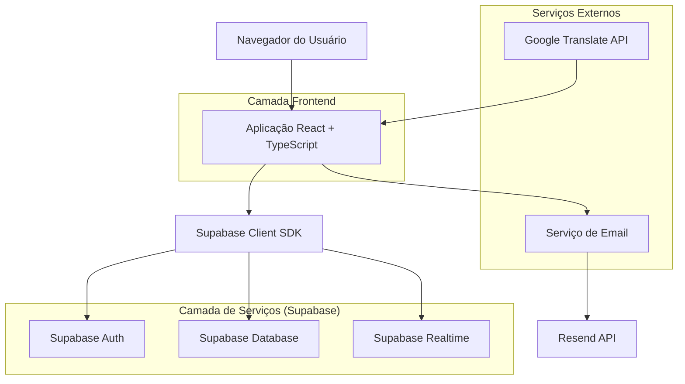
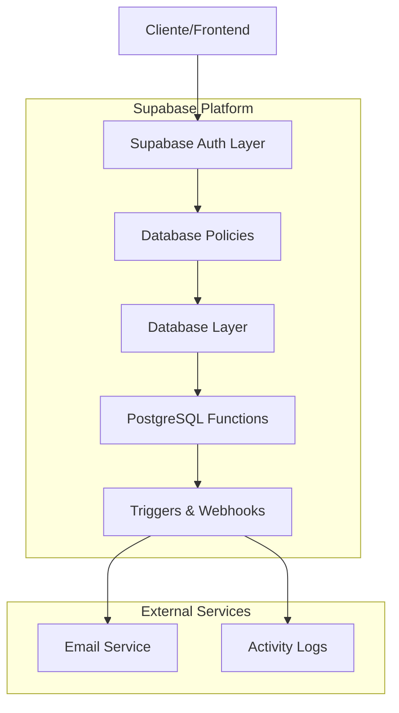
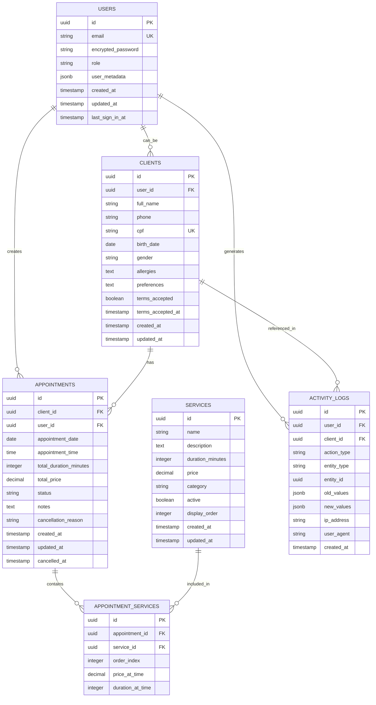

## 1. Arquitetura do Sistema



## 2. Stack Tecnológica

- **Frontend**: React@18 + TypeScript@5 + Vite@5 + Tailwind CSS@3
- **Backend**: Supabase (BaaS - Backend as a Service)
- **Banco de Dados**: PostgreSQL (via Supabase)
- **Autenticação**: Supabase Auth (Google OAuth + Email/Password)
- **Notificações**: Resend API para emails transacionais
- **Tradução**: Google Translate API
- **UI Components**: Headless UI + Radix UI + Lucide React (ícones)
- **Estado Global**: React Context + useReducer
- **Formulários**: React Hook Form + Zod (validação)
- **Data/Hora**: date-fns + react-datepicker
- **Calendário**: react-big-calendar ou FullCalendar

## 3. Definições de Rotas

| Rota | Propósito |
|------|-----------|
| `/` | Página inicial do salão com apresentação e serviços |
| `/agendar` | Interface de agendamento com seleção de serviços e horários |
| `/confirmacao` | Página de confirmação após agendamento bem-sucedido |
| `/cliente/login` | Login de clientes existentes |
| `/cliente/cadastro` | Cadastro de novos clientes |
| `/cliente/painel` | Dashboard do cliente com histórico de agendamentos |
| `/cliente/agendamentos` | Lista detalhada de agendamentos do cliente |
| `/admin/login` | Login administrativo para staff do salão |
| `/admin/dashboard` | Dashboard principal administrativo com calendário |
| `/admin/clientes` | Gestão de clientes (CRUD completo) |
| `/admin/servicos` | Gestão de serviços oferecidos |
| `/admin/horarios` | Configuração de disponibilidade de horários |
| `/admin/relatorios` | Relatórios financeiros e estatísticas |
| `/admin/configuracoes` | Configurações gerais do sistema |
| `/termos` | Página de termos e condições |
| `/privacidade` | Política de privacidade (LGPD) |

## 4. Definições de API

### 4.1 Autenticação

```typescript
// Login com email/senha
POST /auth/v1/token?grant_type=password

Request:
{
  "email": "cliente@email.com",
  "password": "senha123"
}

Response:
{
  "access_token": "eyJhbGc...",
  "token_type": "bearer",
  "expires_in": 3600,
  "refresh_token": "abcdef123456...",
  "user": {
    "id": "uuid",
    "email": "cliente@email.com",
    "role": "cliente" | "admin" | "owner"
  }
}
```

### 4.2 Agendamentos

```typescript
// Criar novo agendamento
POST /rest/v1/appointments

Headers:
- Authorization: Bearer {token}
- apikey: {supabase_anon_key}

Request:
{
  "client_id": "uuid",
  "service_ids": ["uuid1", "uuid2"],
  "appointment_date": "2024-01-15",
  "appointment_time": "14:00",
  "total_duration": 120, // minutos
  "total_price": 280.00,
  "status": "confirmed",
  "notes": "Cliente alérgica a produtos com perfume"
}

Response: Appointment object com ID gerado
```

### 4.3 Serviços

```typescript
// Listar serviços disponíveis
GET /rest/v1/services?select=*&active=eq.true

Response:
[
  {
    "id": "uuid",
    "name": "Manicure",
    "description": "Tratamento completo de unhas",
    "duration": 60, // minutos
    "price": 80.00,
    "category": "Unhas",
    "active": true,
    "created_at": "2024-01-01T00:00:00Z"
  }
]
```

## 5. Arquitetura do Servidor



## 6. Modelo de Dados

### 6.1 Diagrama ER



### 6.2 Definições de Tabelas (DDL)

```sql
-- Tabela de usuários (gerenciada pelo Supabase Auth)
-- Users table is managed by Supabase Auth, no need to create manually

-- Tabela de clientes
CREATE TABLE clients (
    id UUID PRIMARY KEY DEFAULT gen_random_uuid(),
    user_id UUID REFERENCES auth.users(id) ON DELETE CASCADE,
    full_name VARCHAR(255) NOT NULL,
    phone VARCHAR(20) NOT NULL,
    cpf VARCHAR(14) UNIQUE,
    birth_date DATE,
    gender VARCHAR(20),
    allergies TEXT,
    preferences TEXT,
    terms_accepted BOOLEAN DEFAULT FALSE,
    terms_accepted_at TIMESTAMP WITH TIME ZONE,
    created_at TIMESTAMP WITH TIME ZONE DEFAULT NOW(),
    updated_at TIMESTAMP WITH TIME ZONE DEFAULT NOW()
);

-- Índices para clients
CREATE INDEX idx_clients_user_id ON clients(user_id);
CREATE INDEX idx_clients_cpf ON clients(cpf);
CREATE INDEX idx_clients_phone ON clients(phone);

-- Tabela de serviços
CREATE TABLE services (
    id UUID PRIMARY KEY DEFAULT gen_random_uuid(),
    name VARCHAR(255) NOT NULL,
    description TEXT,
    duration_minutes INTEGER NOT NULL CHECK (duration_minutes > 0),
    price DECIMAL(10,2) NOT NULL CHECK (price >= 0),
    category VARCHAR(100),
    active BOOLEAN DEFAULT TRUE,
    display_order INTEGER DEFAULT 0,
    created_at TIMESTAMP WITH TIME ZONE DEFAULT NOW(),
    updated_at TIMESTAMP WITH TIME ZONE DEFAULT NOW()
);

-- Índices para services
CREATE INDEX idx_services_active ON services(active);
CREATE INDEX idx_services_category ON services(category);
CREATE INDEX idx_services_display_order ON services(display_order);

-- Tabela de agendamentos
CREATE TABLE appointments (
    id UUID PRIMARY KEY DEFAULT gen_random_uuid(),
    client_id UUID REFERENCES clients(id) ON DELETE CASCADE,
    user_id UUID REFERENCES auth.users(id) ON DELETE SET NULL,
    appointment_date DATE NOT NULL,
    appointment_time TIME NOT NULL,
    total_duration_minutes INTEGER NOT NULL CHECK (total_duration_minutes > 0),
    total_price DECIMAL(10,2) NOT NULL CHECK (total_price >= 0),
    status VARCHAR(50) NOT NULL DEFAULT 'confirmed' 
        CHECK (status IN ('confirmed', 'completed', 'cancelled', 'no_show')),
    notes TEXT,
    cancellation_reason TEXT,
    created_at TIMESTAMP WITH TIME ZONE DEFAULT NOW(),
    updated_at TIMESTAMP WITH TIME ZONE DEFAULT NOW(),
    cancelled_at TIMESTAMP WITH TIME ZONE
);

-- Índices para appointments
CREATE INDEX idx_appointments_client_id ON appointments(client_id);
CREATE INDEX idx_appointments_date ON appointments(appointment_date);
CREATE INDEX idx_appointments_time ON appointments(appointment_time);
CREATE INDEX idx_appointments_status ON appointments(status);
CREATE INDEX idx_appointments_date_time ON appointments(appointment_date, appointment_time);

-- Tabela de relacionamento agendamentos-serviços
CREATE TABLE appointment_services (
    id UUID PRIMARY KEY DEFAULT gen_random_uuid(),
    appointment_id UUID REFERENCES appointments(id) ON DELETE CASCADE,
    service_id UUID REFERENCES services(id) ON DELETE CASCADE,
    order_index INTEGER DEFAULT 0,
    price_at_time DECIMAL(10,2) NOT NULL,
    duration_at_time INTEGER NOT NULL,
    UNIQUE(appointment_id, service_id, order_index)
);

-- Índices para appointment_services
CREATE INDEX idx_appointment_services_appointment_id ON appointment_services(appointment_id);
CREATE INDEX idx_appointment_services_service_id ON appointment_services(service_id);

-- Tabela de logs de atividade
CREATE TABLE activity_logs (
    id UUID PRIMARY KEY DEFAULT gen_random_uuid(),
    user_id UUID REFERENCES auth.users(id) ON DELETE SET NULL,
    client_id UUID REFERENCES clients(id) ON DELETE SET NULL,
    action_type VARCHAR(100) NOT NULL,
    entity_type VARCHAR(100) NOT NULL,
    entity_id UUID,
    old_values JSONB,
    new_values JSONB,
    ip_address INET,
    user_agent TEXT,
    created_at TIMESTAMP WITH TIME ZONE DEFAULT NOW()
);

-- Índices para activity_logs
CREATE INDEX idx_activity_logs_user_id ON activity_logs(user_id);
CREATE INDEX idx_activity_logs_client_id ON activity_logs(client_id);
CREATE INDEX idx_activity_logs_action_type ON activity_logs(action_type);
CREATE INDEX idx_activity_logs_entity ON activity_logs(entity_type, entity_id);
CREATE INDEX idx_activity_logs_created_at ON activity_logs(created_at DESC);

-- Permissões básicas (Supabase RLS)
-- Permissões para clients
ALTER TABLE clients ENABLE ROW LEVEL SECURITY;

-- Clientes podem ver apenas seus próprios dados
CREATE POLICY "clients_select_own" ON clients
    FOR SELECT USING (
        auth.uid() = user_id
    );

-- Clientes podem inserir seus próprios dados
CREATE POLICY "clients_insert_own" ON clients
    FOR INSERT WITH CHECK (
        auth.uid() = user_id
    );

-- Clientes podem atualizar apenas seus próprios dados
CREATE POLICY "clients_update_own" ON clients
    FOR UPDATE USING (
        auth.uid() = user_id
    );

-- Administradores podem ver todos os clientes
CREATE POLICY "admin_select_all_clients" ON clients
    FOR SELECT USING (
        auth.jwt() ->> 'role' IN ('admin', 'owner')
    );

-- Grant básico para anon e authenticated
GRANT SELECT ON clients TO anon;
GRANT ALL ON clients TO authenticated;

-- Permissões para services (visíveis para todos)
ALTER TABLE services ENABLE ROW LEVEL SECURITY;
CREATE POLICY "services_select_all" ON services
    FOR SELECT USING (active = true);

GRANT SELECT ON services TO anon;
GRANT ALL ON services TO authenticated;

-- Permissões para appointments
ALTER TABLE appointments ENABLE ROW LEVEL SECURITY;

-- Clientes podem ver apenas seus próprios agendamentos
CREATE POLICY "appointments_select_own" ON appointments
    FOR SELECT USING (
        auth.uid() IN (
            SELECT user_id FROM clients WHERE id = appointments.client_id
        )
    );

-- Administradores podem ver todos os agendamentos
CREATE POLICY "admin_select_all_appointments" ON appointments
    FOR SELECT USING (
        auth.jwt() ->> 'role' IN ('admin', 'owner')
    );

GRANT SELECT ON appointments TO anon;
GRANT ALL ON appointments TO authenticated;
```

## 7. Segurança e Compliance

### 7.1 Medidas de Segurança
- **Autenticação**: JWT tokens com expiração de 1 hora, refresh tokens de 7 dias
- **Autorização**: Row Level Security (RLS) no PostgreSQL com políticas granulares
- **Criptografia**: SSL/TLS obrigatório, dados sensíveis criptografados em repouso
- **Rate Limiting**: Limite de 100 requisições por minuto por IP
- **Validação**: Sanitização de inputs com Zod schemas, proteção XSS
- **Auditoria**: Logs completos de todas as operações sensíveis

### 7.2 Conformidade LGPD
- **Consentimento**: Checkbox obrigatório para aceitação de termos e política de privacidade
- **Direito ao Esquecimento**: Endpoint para exclusão completa de dados pessoais
- **Portabilidade**: Exportação de dados em formato JSON/CSV
- **Transparência**: Política de privacidade clara e acessível
- **Retenção**: Dados de agendamentos mantidos por 5 anos, dados pessoais excluídos após 2 anos de inatividade

### 7.3 Configurações de Email
```typescript
// Templates de Email (Resend API)
interface EmailTemplates {
  confirmation: {
    subject: "Confirmação de Agendamento - [Salão]",
    template: "appointment-confirmation",
    variables: ["client_name", "service_names", "date", "time", "price", "qr_code"]
  };
  reminder: {
    subject: "Lembrete: Seu agendamento amanhã",
    template: "appointment-reminder",
    variables: ["client_name", "service_names", "date", "time", "cancellation_link"]
  };
  cancellation: {
    subject: "Agendamento Cancelado",
    template: "appointment-cancellation",
    variables: ["client_name", "service_names", "date", "time", "reason"]
  };
}
```

## 8. Performance e Otimização

### 8.1 Metas de Performance
- **LCP (Largest Contentful Paint)**: < 2.5 segundos
- **FID (First Input Delay)**: < 100 milissegundos
- **CLS (Cumulative Layout Shift)**: < 0.1
- **FCP (First Contentful Paint)**: < 1.8 segundos

### 8.2 Otimizações
- **Code Splitting**: Lazy loading por rotas e componentes pesados
- **Image Optimization**: WebP format, responsive images, blur-up technique
- **Caching**: Service Worker para assets estáticos, SWR para dados dinâmicos
- **Bundle Size**: < 200KB para JavaScript inicial, tree shaking ativo
- **Database**: Índices otimizados, queries com SELECT específico, paginação em listas grandes

### 8.3 Monitoramento
- **Error Tracking**: Sentry para captura de erros em produção
- **Performance**: Web Vitals monitoring com relatórios para Google Analytics
- **Uptime**: Status page com monitoramento de disponibilidade
- **Analytics**: Event tracking para conversão de agendamentos, taxa de cancelamento