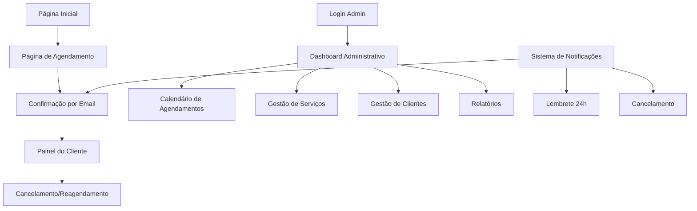

## 1. Visão Geral do Produto

Sistema de agendamento online para salões de beleza que conecta clientes com serviços de estética de forma simples e eficiente. O sistema permite que clientes agendem serviços, administrem seus compromissos e recebam notificações, enquanto oferece aos proprietários ferramentas completas para gerenciar horários, funcionários e relatórios.

**Problema resolvido:** Elimina o trabalho manual de agendamento via telefone/WhatsApp, reduz falhas de comunicação e permite 24/7 de agendamentos. **Público-alvo:** Salões de beleza, clínicas de estética e profissionais de beleza independentes.

## 2. Funcionalidades Principais

### 2.1 Papéis de Usuário

| Papel | Método de Registro | Permissões Principais |
|-------|-------------------|----------------------|
| Cliente | Auto-cadastro com email | Agendar serviços, visualizar histórico, cancelar agendamentos |
| Administrador | Cadastro pelo proprietário | Gerenciar agendamentos, clientes, serviços e funcionários |
| Proprietário | Cadastro inicial | Todas as permissões do admin + relatórios financeiros e configurações do sistema |

### 2.2 Módulos de Funcionalidades

Nosso sistema de agendamento de salão de beleza consiste nas seguintes páginas principais:

1. **Página Inicial**: Apresentação do salão, serviços disponíveis, botão para agendamento.
2. **Página de Agendamento**: Seleção de serviços, escolha de data/horário, formulário de dados pessoais.
3. **Painel do Cliente**: Visualização de agendamentos, histórico, cancelamento, reagendamento.
4. **Dashboard Administrativo**: Calendário de agendamentos, gestão de clientes/serviços, relatórios.
5. **Sistema de Notificações**: Email automáticos para confirmações, lembretes e cancelamentos.

### 2.3 Detalhes das Páginas

| Nome da Página | Módulo | Descrição das Funcionalidades |
|----------------|---------|------------------------------|
| Página Inicial | Seção Hero | Apresentação do salão com imagens, descrição breve e CTA principal para agendamento. |
| Página Inicial | Serviços | Lista de serviços oferecidos com preços, duração e descrição. Suporte a múltiplas categorias. |
| Página Inicial | Informações de Contato | Endereço, telefone, horário de funcionamento, mapa de localização. |
| Agendamento | Seleção de Serviços | Interface para escolher um ou mais serviços, mostrando tempo total e preço estimado. |
| Agendamento | Calendário de Disponibilidade | Visualização mensal/semanal com horários disponíveis, bloqueio de horários indisponíveis. |
| Agendamento | Formulário de Dados | Captura de nome, email, telefone, observações. Validação de campos obrigatórios. |
| Painel Cliente | Lista de Agendamentos | Visualização de agendamentos ativos e histórico com filtros por data e status. |
| Painel Cliente | Cancelamento/Reagendamento | Permite cancelar até 24h antes e reagendar com disponibilidade em tempo real. |
| Dashboard Admin | Calendário Principal | Visualização completa de agendamentos por dia/semana/mês com cores por status. |
| Dashboard Admin | Gestão de Clientes | CRUD completo de clientes com busca, histórico de atendimentos e estatísticas. |
| Dashboard Admin | Gestão de Serviços | Adicionar/editar/remover serviços com nome, descrição, preço, duração e categoria. |
| Dashboard Admin | Relatórios | Relatórios de faturamento, serviços mais populares, horários de pico. |
| Notificações | Email de Confirmação | Envio automático após agendamento com detalhes do serviço e QR code. |
| Notificações | Lembrete de Horário | Email automático 24h antes do agendamento com opção de cancelamento. |
| Notificações | Cancelamento | Notificação imediata ao cliente e admin quando houver cancelamento. |

## 3. Fluxo Principal de Operações

### Fluxo do Cliente
1. Acessa a página inicial → Visualiza serviços → Clica em "Agendar"
2. Seleciona serviços desejados → Escolhe data/horário disponível → Preenche dados pessoais
3. Recebe confirmação por email → Acessa painel para gerenciar agendamentos
4. Recebe lembrete 24h antes → Comparece ao salão → Recebe email de pós-atendimento

### Fluxo do Administrador
1. Login no dashboard → Visualiza calendário de agendamentos
2. Gerencia disponibilidade de horários → Confirma/cancela agendamentos conforme necessário
3. Cadastra/atualiza serviços → Visualiza relatórios de desempenho
4. Exporta relatórios financeiros → Gerencia configurações do sistema

## 4. Design de Interface

### 4.1 Estilo de Design
- **Cores Primárias**: Rosa suave (#FFB6C1) e branco para elegância feminina
- **Cores Secundárias**: Dourado claro (#FFD700) para acentos e CTAs
- **Botões**: Estilo arredondado com sombra suave, hover effects suaves
- **Tipografia**: Fonte serifada elegante para títulos, sans-serif moderna para conteúdo
- **Layout**: Baseado em cards com espaçamento generoso, navegação superior fixa
- **Ícones**: Estilo outline minimalista, preferencialmente em SVG

### 4.2 Visão Geral das Páginas

| Página | Módulo | Elementos de UI |
|--------|---------|-----------------|
| Página Inicial | Hero Section | Imagem de fundo desfocada, texto sobreposto com animação fade-in, botão CTA destacado em dourado |
| Página Inicial | Cards de Serviços | Grid responsivo 3 colunas desktop, 1 coluna mobile, cards com hover animation e preço destacado |
| Agendamento | Calendário | Visualização mensal com dias disponíveis em verde, ocupados em cinza, seleção em rosa |
| Agendamento | Formulário | Campos com bordas arredondadas, validação em tempo real, indicador de progresso do agendamento |
| Dashboard | Calendário Admin | Visualização semanal com drag-and-drop para reagendamento, cores por status (confirmado=verde, cancelado=vermelho) |
| Dashboard | Tabelas | Tabelas com ordenação, busca em tempo real, paginação, ações em dropdown |

### 4.3 Responsividade
- **Mobile-First**: Design otimizado para smartphones, carregamento rápido em 3G
- **Breakpoints**: 320px (mobile), 768px (tablet), 1024px (desktop), 1440px (wide)
- **Touch Optimization**: Botões mínimo 44px, swipe para navegação em calendários
- **Performance**: Imagens otimizadas WebP, lazy loading, CSS inline crítico

## 5. Requisitos Adicionais

### 5.1 Suporte Multi-idioma
- Integração com Google Translate para tradução automática
- Idiomas principais: Português (BR), Inglês, Espanhol
- Fallback para português quando tradução não disponível
- Preservação de termos técnicos e nomes próprios

### 5.2 Sistema de Notificações por Email
- Templates responsivos para todos os tipos de notificação
- Personalização com logo e cores do salão
- Inclusão de QR code para check-in rápido
- Anexos de políticas e termos quando necessário

### 5.3 Conformidade e Segurança
- **LGPD Compliance**: Consentimento explícito para coleta de dados, direito ao esquecimento
- **Termos e Condições**: Aceitação obrigatória no primeiro acesso, versão com data de atualização
- **Política de Cancelamento**: Regras claras (mínimo 24h), sistema de multas para cancelamentos tardios
- **Proteção de Dados**: Criptografia de dados sensíveis, logs de acesso, backup automático diário

### 5.4 Otimizações de Performance
- **Carregamento**: Página inicial < 3 segundos em 3G, lazy loading de imagens
- **SEO**: Meta tags otimizadas, schema markup para local business, sitemap XML
- **Analytics**: Integração Google Analytics 4, eventos de conversão tracking
- **Cache**: Service worker para funcionamento offline básico, cache de API calls